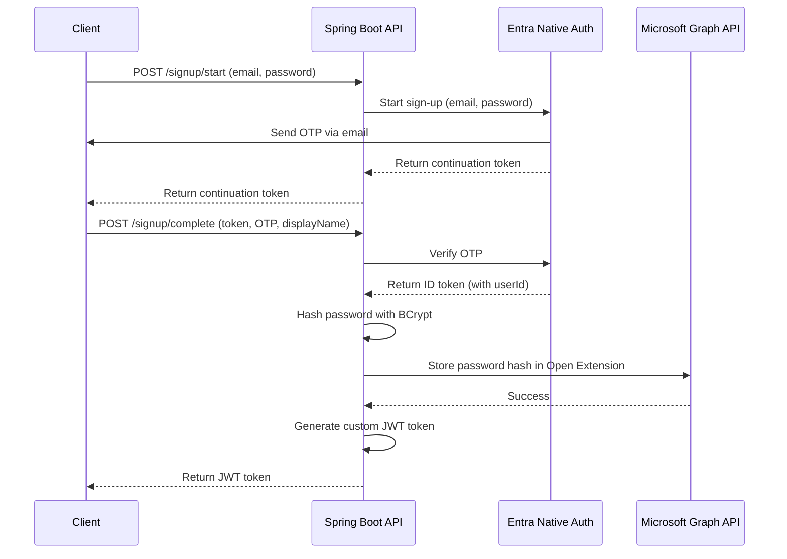
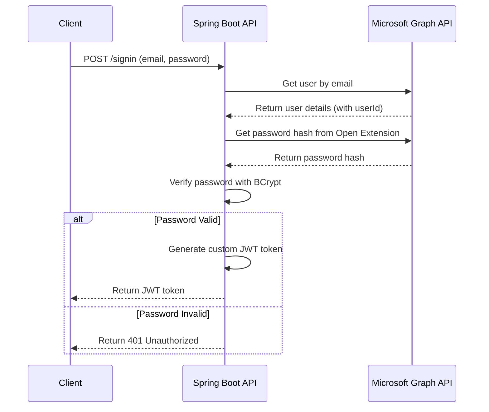
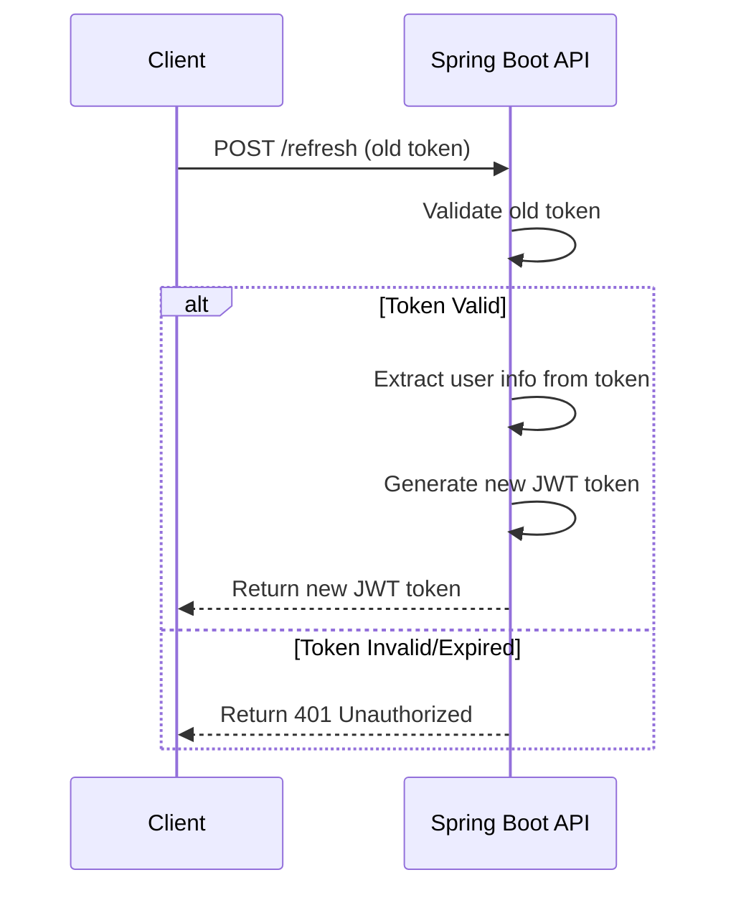

# Microsoft Entra External ID - Hybrid Authentication POC

## 📋 Table of Contents
- [Overview](#overview)
- [Architecture](#architecture)
- [Key Features](#key-features)
- [Technology Stack](#technology-stack)
- [Prerequisites](#prerequisites)
- [Configuration](#configuration)
- [API Documentation](#api-documentation)
- [Authentication Flows](#authentication-flows)
- [Password Storage](#password-storage)
- [Running the Application](#running-the-application)
- [Testing](#testing)
- [Security Considerations](#security-considerations)

---

## 🎯 Overview

This POC demonstrates a **Hybrid Authentication System** that combines:
- **Microsoft Entra External ID Native Auth** (for OTP-based sign-up)
- **Custom JWT Tokens** (for password-based sign-in)
- **Microsoft Graph API** (for user management)
- **BCrypt Password Hashing** (for secure password storage)

### Problem Statement
Traditional Azure AD B2C and Entra External ID solutions require browser redirects for authentication. This POC provides a **no-redirect authentication solution** suitable for:
- Mobile applications
- Desktop applications
- API-first architectures
- Microservices

### Solution Highlights
✅ **No browser redirect required**  
✅ **OTP verification for sign-up** (via Native Auth)  
✅ **Password-based sign-in** (custom implementation)  
✅ **Custom JWT tokens** with configurable lifetime (30-90 days)  
✅ **No SharePoint license required** (uses Graph Open Extensions)  
✅ **BCrypt password hashing** for security  

---

## 🏗️ Architecture

### High-Level Architecture

```
┌─────────────────┐
│   Client App    │
│ (Web/Mobile/API)│
└────────┬────────┘
         │
         ▼
┌─────────────────────────────────────────────────────┐
│           Spring Boot Application                   │
│  ┌──────────────────────────────────────────────┐  │
│  │         HybridAuthController                 │  │
│  │  /api/v1/hybrid-auth/*                       │  │
│  └──────────────┬───────────────────────────────┘  │
│                 │                                   │
│  ┌──────────────▼───────────────────────────────┐  │
│  │       HybridAuthService                      │  │
│  │  - Sign-up flow (OTP)                        │  │
│  │  - Sign-in flow (Password)                   │  │
│  │  - JWT token generation                      │  │
│  └──────────────┬───────────────────────────────┘  │
│                 │                                   │
│  ┌──────────────▼───────────────────────────────┐  │
│  │       GraphApiService                        │  │
│  │  - User CRUD operations                      │  │
│  │  - Password hash storage (Open Extensions)   │  │
│  └──────────────┬───────────────────────────────┘  │
└─────────────────┼───────────────────────────────────┘
                  │
         ┌────────┴────────┐
         ▼                 ▼
┌──────────────────┐  ┌──────────────────┐
│ Entra Native Auth│  │ Microsoft Graph  │
│   (OTP Service)  │  │   API (Users)    │
└──────────────────┘  └──────────────────┘
```

### Component Breakdown

| Component | Responsibility |
|-----------|---------------|
| **HybridAuthController** | REST API endpoints for authentication |
| **HybridAuthService** | Business logic for sign-up, sign-in, token management |
| **GraphApiService** | Integration with Microsoft Graph API |
| **EntraGraphApiService** | Implementation of Graph API operations |
| **JWT Token Manager** | Custom JWT token generation and validation |
| **BCrypt Password Manager** | Password hashing and verification |

---

## ✨ Key Features

### 1. **Hybrid Sign-Up Flow**
- Uses **Entra Native Auth API** for OTP-based email verification
- Stores BCrypt-hashed password in **Microsoft Graph Open Extensions**
- Returns custom JWT token (not Microsoft's refresh token)

### 2. **Password-Based Sign-In**
- Retrieves password hash from Graph Open Extensions
- Verifies password using BCrypt
- Generates custom JWT token with configurable lifetime

### 3. **User Management**
- Create, read, update, delete users via Graph API
- Enable/disable user accounts
- Force password reset
- No SharePoint license required

### 4. **Custom JWT Tokens**
- Configurable token lifetime (default: 30 days)
- Avoids Microsoft's 12-24 hour refresh token bug
- Standard JWT format (HS256 algorithm)

---

## 🛠️ Technology Stack

- **Java 17**
- **Spring Boot 3.x**
- **Microsoft Entra External ID**
- **Microsoft Graph API v1.0**
- **OkHttp** (HTTP client)
- **BCrypt** (password hashing)
- **JWT (Auth0)** (token generation)
- **Jackson** (JSON processing)
- **Lombok** (boilerplate reduction)

---

## 📋 Prerequisites

### 1. Microsoft Entra External ID Tenant
- Create an External ID tenant at [Microsoft Entra Admin Center](https://entra.microsoft.com)
- Note your **Tenant Subdomain** (e.g., `contosocustomersnativeapp`)
- Note your **Tenant ID** (e.g., `db186b60-1fdd-4899-afd6-b6b2f0286f81`)

### 2. App Registration

1. **Register a new application** in your Entra External ID tenant
2. **Enable Native Authentication**:
   - Go to **Authentication** → **Platform configurations**
   - Add **Mobile and desktop applications**
   - Enable **Native Authentication**
3. **API Permissions**:
   - `User.ReadWrite.All` (Application permission)
   - `Directory.ReadWrite.All` (Application permission)
   - Grant admin consent
4. **Create Client Secret**:
   - Go to **Certificates & secrets**
   - Create a new client secret
   - Note the **Client ID** and **Client Secret**

### 3. Development Environment
- **Java 17+**
- **Gradle 7.x+**
- **IDE** (IntelliJ IDEA, VS Code, Eclipse)

---

## ⚙️ Configuration

### Application Configuration (`application.yml`)

```yaml
entra:
  external-id:
    tenant-subdomain: contosocustomersnativeapp  # Your tenant subdomain
    tenant-id: db186b60-1fdd-4899-afd6-b6b2f0286f81  # Your tenant ID
    client-id: bfe55ca6-7c7f-4c6e-8d29-077a3136f98c  # Your client ID
    scope: openid profile email offline_access

jwt:
  secret: your-super-secret-key-change-this-in-production  # Change in production!
  issuer: tessell-iam
  token:
    lifetime:
      days: 30  # Token lifetime in days
```

### Environment Variables (Optional)

You can override configuration using environment variables:

```bash
export ENTRA_EXTERNAL_ID_TENANT_SUBDOMAIN=your-tenant
export ENTRA_EXTERNAL_ID_TENANT_ID=your-tenant-id
export ENTRA_EXTERNAL_ID_CLIENT_ID=your-client-id
export ENTRA_EXTERNAL_ID_CLIENT_SECRET=your-client-secret
export JWT_SECRET=your-jwt-secret
export JWT_TOKEN_LIFETIME_DAYS=30
```

---

## 📚 API Documentation

### Base URL
```
http://localhost:8080
```

### 1. Hybrid Authentication APIs

#### 1.1 Sign-Up Start
**Endpoint:** `POST /api/v1/hybrid-auth/signup/start`

**Description:** Initiates sign-up flow and sends OTP to user's email.

**Request:**
```http
POST /api/v1/hybrid-auth/signup/start?email=user@example.com&password=SecurePass123!
```

**Query Parameters:**
| Parameter | Type | Required | Description |
|-----------|------|----------|-------------|
| email | string | Yes | User's email address |
| password | string | Yes | User's password (min 8 characters) |

**Response:**
```json
{
  "success": true,
  "message": null,
  "data": {
    "continuationToken": "uY29tL2F1dGhlbnRpY2F0ZS9vb2IvdjEuMC...",
    "message": "OTP sent to your email"
  }
}
```

**Status Codes:**
- `200 OK` - OTP sent successfully
- `400 Bad Request` - Invalid email or password

---

#### 1.2 Sign-Up Complete
**Endpoint:** `POST /api/v1/hybrid-auth/signup/complete`

**Description:** Completes sign-up by verifying OTP and creating user account.

**Request:**
```http
POST /api/v1/hybrid-auth/signup/complete?continuationToken=TOKEN&otp=12345678&displayName=John%20Doe
```

**Query Parameters:**
| Parameter | Type | Required | Description |
|-----------|------|----------|-------------|
| continuationToken | string | Yes | Token from signup/start |
| otp | string | Yes | 8-digit OTP from email |
| displayName | string | Yes | User's display name |

**Response:**
```json
{
  "success": true,
  "message": null,
  "data": {
    "access_token": "eyJhbGciOiJIUzI1NiIsInR5cCI6IkpXVCJ9...",
    "token_type": "Bearer",
    "expires_in": 2592000,
    "id_token": null,
    "refresh_token": null,
    "scope": null
  }
}
```

**Status Codes:**
- `200 OK` - User created successfully
- `400 Bad Request` - Invalid OTP or token

---

#### 1.3 Sign-In
**Endpoint:** `POST /api/v1/hybrid-auth/signin`

**Description:** Authenticates user with email and password.

**Request:**
```http
POST /api/v1/hybrid-auth/signin
Content-Type: application/json

{
  "email": "user@example.com",
  "password": "SecurePass123!"
}
```

**Response:**
```json
{
  "success": true,
  "message": null,
  "data": {
    "access_token": "eyJhbGciOiJIUzI1NiIsInR5cCI6IkpXVCJ9...",
    "token_type": "Bearer",
    "expires_in": 2592000
  }
}
```

**Status Codes:**
- `200 OK` - Authentication successful
- `401 Unauthorized` - Invalid credentials
- `404 Not Found` - User not found

---

#### 1.4 Token Validation
**Endpoint:** `POST /api/v1/hybrid-auth/validate`

**Description:** Validates a JWT token.

**Request:**
```http
POST /api/v1/hybrid-auth/validate
Content-Type: application/json

{
  "token": "eyJhbGciOiJIUzI1NiIsInR5cCI6IkpXVCJ9..."
}
```

**Response:**
```json
{
  "success": true,
  "message": "Token is valid",
  "data": {
    "sub": "ccc1d5de-f629-4d1d-9ce0-8a635fc0454f",
    "email": "user@example.com",
    "name": "John Doe",
    "iss": "tessell-iam",
    "iat": 1768210679,
    "exp": 1770802679
  }
}
```

**Status Codes:**
- `200 OK` - Token is valid
- `401 Unauthorized` - Token is invalid or expired

---

#### 1.5 Token Refresh
**Endpoint:** `POST /api/v1/hybrid-auth/refresh`

**Description:** Refreshes an existing JWT token.

**Request:**
```http
POST /api/v1/hybrid-auth/refresh
Content-Type: application/json

{
  "token": "eyJhbGciOiJIUzI1NiIsInR5cCI6IkpXVCJ9..."
}
```

**Response:**
```json
{
  "success": true,
  "message": null,
  "data": {
    "access_token": "eyJhbGciOiJIUzI1NiIsInR5cCI6IkpXVCJ9...",
    "token_type": "Bearer",
    "expires_in": 2592000
  }
}
```

---

### 2. User Management APIs

#### 2.1 Create User
**Endpoint:** `POST /api/users`

**Description:** Creates a new user directly via Graph API (bypasses OTP).

**Request:**
```http
POST /api/users
Content-Type: application/json

{
  "email": "newuser@example.com",
  "displayName": "New User",
  "password": "SecurePass123!"
}
```

**Response:**
```json
{
  "success": true,
  "message": "User created successfully",
  "data": {
    "id": "ccc1d5de-f629-4d1d-9ce0-8a635fc0454f",
    "userPrincipalName": "newuser@example.com",
    "displayName": "New User",
    "accountEnabled": true
  }
}
```

---

#### 2.2 Get User
**Endpoint:** `GET /api/users/{email}`

**Description:** Retrieves user details by email.

**Request:**
```http
GET /api/users/user@example.com
```

**Response:**
```json
{
  "success": true,
  "message": null,
  "data": {
    "id": "ccc1d5de-f629-4d1d-9ce0-8a635fc0454f",
    "userPrincipalName": "user@example.com",
    "displayName": "John Doe",
    "accountEnabled": true,
    "mail": "user@example.com"
  }
}
```

---

#### 2.3 Delete User
**Endpoint:** `DELETE /api/users/{email}`

**Description:** Deletes a user by email.

**Request:**
```http
DELETE /api/users/user@example.com
```

**Response:**
```json
{
  "success": true,
  "message": "User deleted successfully",
  "data": null
}
```

---

#### 2.4 Disable User
**Endpoint:** `PATCH /api/users/{email}/disable`

**Description:** Disables a user account.

**Request:**
```http
PATCH /api/users/user@example.com/disable
```

**Response:**
```json
{
  "success": true,
  "message": "User disabled successfully",
  "data": null
}
```

---

#### 2.5 Enable User
**Endpoint:** `PATCH /api/users/{email}/enable`

**Description:** Enables a user account.

**Request:**
```http
PATCH /api/users/user@example.com/enable
```

**Response:**
```json
{
  "success": true,
  "message": "User enabled successfully",
  "data": null
}
```

---

#### 2.6 Force Password Reset
**Endpoint:** `POST /api/users/{email}/force-password-reset`

**Description:** Forces user to reset password on next login.

**Request:**
```http
POST /api/users/user@example.com/force-password-reset
```

**Response:**
```json
{
  "success": true,
  "message": "Force password reset set successfully",
  "data": null
}
```

---

## 🔄 Authentication Flows

### Sign-Up Flow (OTP-Based)



**Step-by-Step:**

1. **Client** sends email and password to `/signup/start`
2. **API** calls Entra Native Auth to initiate sign-up
3. **Native Auth** sends 8-digit OTP to user's email
4. **API** returns continuation token to client
5. **Client** receives OTP from email and sends it with continuation token to `/signup/complete`
6. **API** verifies OTP with Native Auth
7. **Native Auth** creates user and returns ID token
8. **API** extracts user ID from ID token
9. **API** hashes password with BCrypt (cost factor 12)
10. **API** stores password hash in Microsoft Graph Open Extension (`com.tessell.auth`)
11. **API** generates custom JWT token (30-day lifetime)
12. **Client** receives JWT token for authentication

---

### Sign-In Flow (Password-Based)



**Step-by-Step:**

1. **Client** sends email and password to `/signin`
2. **API** queries Microsoft Graph API for user by email
3. **Graph API** returns user details including user ID
4. **API** retrieves password hash from Open Extension (`com.tessell.auth`)
5. **API** verifies password using BCrypt comparison
6. If valid:
   - **API** generates custom JWT token
   - **Client** receives JWT token
7. If invalid:
   - **API** returns 401 Unauthorized error

---

### Token Refresh Flow



---

## 🔐 Password Storage

### Storage Mechanism: Microsoft Graph Open Extensions

**Why Open Extensions?**
- ✅ No SharePoint Online license required
- ✅ Available in all Microsoft Entra ID tenants
- ✅ Proper way to store custom user attributes
- ✅ Secure and compliant with Microsoft standards

### Extension Details

| Property | Value |
|----------|-------|
| **Extension Name** | `com.tessell.auth` |
| **Attribute Name** | `passwordHash` |
| **Hash Algorithm** | BCrypt |
| **Cost Factor** | 12 |
| **API Endpoint** | `/users/{userId}/extensions/com.tessell.auth` |

### Storage Example

**Create Extension:**
```http
POST https://graph.microsoft.com/v1.0/users/{userId}/extensions
Content-Type: application/json

{
  "@odata.type": "microsoft.graph.openTypeExtension",
  "extensionName": "com.tessell.auth",
  "passwordHash": "$2a$12$OC1GSEg2ctLb1IuWRAdbCex5WEbh4/LMHclq2GNP2FFm9K68P3muO"
}
```

**Update Extension:**
```http
PATCH https://graph.microsoft.com/v1.0/users/{userId}/extensions/com.tessell.auth
Content-Type: application/json

{
  "passwordHash": "$2a$12$NEW_HASH_VALUE"
}
```

**Retrieve Extension:**
```http
GET https://graph.microsoft.com/v1.0/users/{userId}/extensions/com.tessell.auth
```

### BCrypt Hashing

**Implementation:**
```java
// Hash password
String hashedPassword = BCrypt.hashpw(plainPassword, BCrypt.gensalt(12));

// Verify password
boolean isValid = BCrypt.checkpw(plainPassword, hashedPassword);
```

**Security Features:**
- **Salt:** Automatically generated per password
- **Cost Factor:** 12 (2^12 = 4,096 iterations)
- **Algorithm:** Blowfish-based adaptive hash function
- **Output:** 60-character string (includes algorithm, cost, salt, and hash)

---

## 🚀 Running the Application

### 1. Clone the Repository
```bash
git clone <repository-url>
cd native-auth
```

### 2. Configure Application
Edit `src/main/resources/application.yml` with your Entra External ID details.

### 3. Build the Application
```bash
./gradlew clean build
```

### 4. Run the Application
```bash
./gradlew bootRun
```

The application will start on `http://localhost:8080`

### 5. Access the Web UI
Open your browser and navigate to:
```
http://localhost:8080
```

---

## 🧪 Testing

### Using the Web UI

1. **Open** `http://localhost:8080` in your browser
2. **Navigate** to the "Sign Up" tab
3. **Enter** email, display name, and password
4. **Click** "Send Verification Code"
5. **Check** your email for the 8-digit OTP
6. **Enter** the OTP and click "Create Account"
7. **Switch** to "Login" tab
8. **Sign in** with your email and password

### Using cURL

#### Sign-Up Start
```bash
curl -X POST "http://localhost:8080/api/v1/hybrid-auth/signup/start?email=test@example.com&password=SecurePass123!"
```

#### Sign-Up Complete
```bash
curl -X POST "http://localhost:8080/api/v1/hybrid-auth/signup/complete?continuationToken=TOKEN&otp=12345678&displayName=Test%20User"
```

#### Sign-In
```bash
curl -X POST http://localhost:8080/api/v1/hybrid-auth/signin \
  -H "Content-Type: application/json" \
  -d '{"email":"test@example.com","password":"SecurePass123!"}'
```

#### Validate Token
```bash
curl -X POST http://localhost:8080/api/v1/hybrid-auth/validate \
  -H "Content-Type: application/json" \
  -d '{"token":"YOUR_JWT_TOKEN"}'
```

### Using Postman

Import the following collection:
1. Create a new collection named "Entra Hybrid Auth"
2. Add requests for each endpoint documented above
3. Set base URL to `http://localhost:8080`

---

## 🔒 Security Considerations

### 1. **Password Security**
- ✅ BCrypt hashing with cost factor 12
- ✅ Automatic salt generation
- ✅ Secure storage in Microsoft Graph Open Extensions
- ⚠️ Never log or expose password hashes

### 2. **JWT Token Security**
- ✅ HS256 algorithm (HMAC with SHA-256)
- ✅ Configurable secret key
- ✅ Token expiration (default: 30 days)
- ⚠️ Change `jwt.secret` in production
- ⚠️ Use strong secret (minimum 256 bits)

### 3. **API Security**
- ⚠️ Implement rate limiting for authentication endpoints
- ⚠️ Add CORS configuration for production
- ⚠️ Use HTTPS in production
- ⚠️ Implement request validation and sanitization

### 4. **Client Secret Protection**
- ⚠️ Never commit secrets to version control
- ⚠️ Use environment variables or secret management services
- ⚠️ Rotate client secrets regularly
- ⚠️ Monitor secret expiration dates

### 5. **Production Checklist**
- [ ] Change JWT secret to a strong random value
- [ ] Enable HTTPS/TLS
- [ ] Configure CORS properly
- [ ] Implement rate limiting
- [ ] Add request logging and monitoring
- [ ] Set up error tracking (e.g., Sentry)
- [ ] Remove test endpoints (`/test/create-user`)
- [ ] Configure proper logging levels
- [ ] Set up database for token blacklisting (optional)
- [ ] Implement account lockout after failed attempts

---

## 📊 Project Structure

```
native-auth/
├── src/
│   ├── main/
│   │   ├── java/com/tessell/entra/
│   │   │   ├── config/
│   │   │   │   ├── EntraExternalIdConfig.java
│   │   │   │   ├── OkHttpConfig.java
│   │   │   │   └── OkHttpProperties.java
│   │   │   ├── controller/
│   │   │   │   ├── HybridAuthController.java
│   │   │   │   └── UserController.java
│   │   │   ├── dto/
│   │   │   │   ├── request/
│   │   │   │   │   ├── CreateUserRequest.java
│   │   │   │   │   ├── LoginRequest.java
│   │   │   │   │   └── TokenRequest.java
│   │   │   │   └── response/
│   │   │   │       ├── ApiResponse.java
│   │   │   │       ├── NativeAuthResponse.java
│   │   │   │       └── TokenResponse.java
│   │   │   ├── service/
│   │   │   │   ├── GraphApiService.java
│   │   │   │   ├── HybridAuthService.java
│   │   │   │   └── impl/
│   │   │   │       ├── EntraGraphApiService.java
│   │   │   │       └── HybridAuthServiceImpl.java
│   │   │   └── NativeAuthApplication.java
│   │   └── resources/
│   │       ├── static/
│   │       │   ├── index.html
│   │       │   ├── app.js
│   │       │   └── styles.css
│   │       └── application.yml
│   └── test/
├── build.gradle
└── README.md
```

---

## 🤝 Contributing

Contributions are welcome! Please follow these guidelines:

1. Fork the repository
2. Create a feature branch (`git checkout -b feature/amazing-feature`)
3. Commit your changes (`git commit -m 'Add amazing feature'`)
4. Push to the branch (`git push origin feature/amazing-feature`)
5. Open a Pull Request

---

## 📝 License

This project is licensed under the MIT License.

---

## 📞 Support

For questions or issues:
- Create an issue in the repository
- Contact the development team

---

## 🙏 Acknowledgments

- **Microsoft Entra External ID** for Native Authentication
- **Microsoft Graph API** for user management
- **Spring Boot** for the application framework
- **BCrypt** for secure password hashing

---

**Built with ❤️ by Tessell Team**

